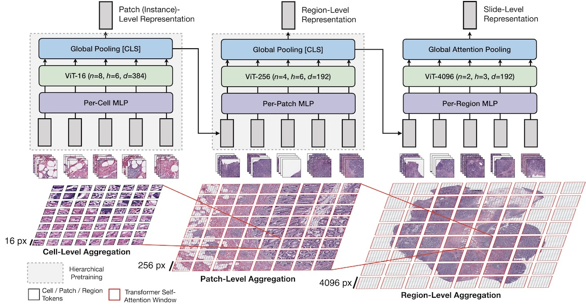

Scaling Vision Transformers to Gigapixel Images via Hierarchical Self-Supervised Learning
===========
<details>
<summary>
  <b>Scaling Vision Transformers to Gigapixel Images via Hierarchical Self-Supervised Learning</b>, CVPR 2022. [HTML][arXiv]
  <br><em>Richard. J. Chen, Chengkuan Chen, Yicong Li, Tiffany Y. Chen, Andrew Trister, Rahul G. Krishnan*, Faisal Mahmood*</em></br>
</summary>

```bash
@inproceedings{chen2022scaling,
  title={Scaling Vision Transformers to Gigapixel Images via Hierarchical Self-Supervised Learning},
  author={Chen, Richard J and Chen, Chengkuan and Li, Yicong and Chen, Tiffany Y and Trister, Andrew D and Krishnan, Rahul G and Mahmood, Faisal},
  booktitle={Proceedings of the IEEE/CVF Conference on Computer Vision and Pattern Recognition},
  year={2022}
}
```
</details>

<div align="center">
  
</div>

**Key Ideas & Main Findings:**
1. We present **Hierarchical Image Pyramid Transformer (HIPT)**, a three-stage hierarchical ViT architecture that formulates gigapixel whole-slide images (WSIs) as a disjoint set of nested sequences. HIPT unroll the WSI into non-overlapping ```[4096 × 4096]``` image regions, followed by unrolling each region into non-overlapping ```[256 × 256]``` image patches, and lastly each patch as non-overlapping ```[16 × 16]``` cell tokens. Our method is analgous to that of hierarchical attention networks in long document modeling, in which word embeddings within sentences are aggregated to form sentence-level embeddings and subsequently aggregated into document-level embeddings. Inference in HIPT is performed via bottom-up aggregation of ```[16 × 16]``` visual tokens in their respective ```[256 × 256]``` and ```[4096 × 4096]``` windows via Transformer attention to compute a slide-level representation.
2. Note that Transformer attention is computed only in local windows (instead of across the entire WSI), which makes learning long-range dependencies tractable. Though representation learning for ```[4096 × 4096]``` image regions may seem expensive, also note that the patch size at this level is ```[256 × 256]```, and thus has similar complexity of applying ViTs to ```[256 × 256]``` image patches with ```[16 × 16]``` tokens.


## Updates / TODOs
Stay tuned for more updates :).
- [ ]
- [X] TODO: Add pretrained models + instructions for hierarchical visualization.
- [X] TODO: Add pre-extracted slide-level embeddings, and code for K-NN evaluation.
- [X] TODO: Add results for Tensorboard.

## Pre-Reqs
We use [Git LFS](https://git-lfs.github.com) to version-control large files in this repository (e.g. - images, embeddings, checkpoints). After installing, to pull these large files, please run:
```bash
git lfs pull
```

## Downloading + Preprocessing + Organizing TCGA Data
Using the [NIH Genomic Data Commons Data Portal](https://portal.gdc.cancer.gov/) and the [cBioPortal](https://www.cbioportal.org/), we downloaded diagnostic whole-slide images (WSIs) for 28 cancer types using the [GDC Data Transfer Tool](https://docs.gdc.cancer.gov/Data_Transfer_Tool/Users_Guide/Data_Download_and_Upload/), followed by using the publicly-available [CLAM library](https://github.com/mahmoodlab/CLAM) for tissue segmentation, tissue patching and feature extraction, which we modified for extracting both ResNet-50 features (pretrained on ImageNet) and ViT-16 features (pretrained on the TCGA). For patching at `[256 × 256]` resolution, we used default tissue segmentation parameters. For patching at `[4096 × 4096]` resolution, we additionally saved each `[4096 × 4096]` image region, which we used for ViT-16/256 pretraining (`-16` suffix == using [16 × 16]-sized tokens in a ViT model, `-256` suffix == using [256 × 256]-sized tokens in a ViT model). Extracted TCGA features are organized in the following example directory:
<details>
<summary>
Example Directory
</summary>
  
```bash
TCGA_ROOT_DIR/
    └──tcga_acc/
        ├── ...
    └──tcga_blca/
        ├── ...
    └──tcga_brca/
        └── WSIs/
            ├── slide_1.svs
            ├── slide_2.svs
            └── ...
        └── extracted_mag20x_patch256_fp/
            └── masks/
                ├── slide_1.png
                ├── slide_2.png
                └── ...
            └── patches/
                ├── slide_1.h5
                ├── slide_2.h5
                └── ...
            └── stitches/
                ├── slide_1.png
                ├── slide_2.png
                └── ...
            └── resnet50_trunc_pt_patch_features/
                ├── slide_1.pt
                ├── slide_2.pt
                └── ...
            └── vits_tcga_pancancer_dino_pt_patch_features/
                ├── slide_1.pt
                ├── slide_2.pt
                └── ...
            └── process_list_autogen.csv
        └── extracted_mag20x_patch4096_fp/
            └── masks/
                ├── slide_1.png
                ├── slide_2.png
                └── ...
            └── patches/
                ├── slide_1.h5
                ├── slide_2.h5
                └── ...
            └── stitches/
                ├── slide_1.png
                ├── slide_2.png
                └── ...
            └── tar_patch_4096/
                ├── slide_1.tar
                ├── slide_2.tar
                └── ...
            └── vits_tcga_pancancer_dino_pt_patch_features/
                ├── slide_1.pt
                ├── slide_2.pt
                └── ...
            └── process_list_autogen.csv
    └──tcga_coadread/
        ├── ...
    ...
    └──tcga_ucec/
        ├── ...
```
</details>

Each cancer type is organized as its own folder in `TCGA_ROOT_DIR`, which additionally contains the following subfolders:
In extracting patches at level 0 with non-overlapping patch sizes of 256, we create a results directory called `extracted_level0_patch256` that will contain the following files / folders:
<details>
  <summary>
    Folder Structure
  </summary>
  
1. `WSIs/`: Raw `*.svs` WSIs for that cancer type
2. `extracted_mag20x_patch256_fp`: Extracted features at 20× magnification for `[256 × 256]` patches (performed only for BRCA, COADREAD, LUAD, LUSC, CCRCC, CHRCC, PRCC, and STAD studies in TCGA). The `_fp` suffix represents the use of 'fast patching" as performed in CLAM, in which coordinates instead of raw patches are saved. This folder contains the following subfolders:
    - `masks/`: Directory of segmented tissue-containing regions (one image per WSI).
    - `patches/`: Directory of extracted image patches (one .h5 file per WSI, where each entry corresponds to the coordinates of the top-left corner of a patch)
    - `stitches/`: Directory of downsampled visualizations of stitched tissue patches, used a sanity check to inspect whether we patched correctly (one image per WSI). 
    - `resnet50_trunc_pt_patch_features/`: Directory of pre-extracted ResNet-50 features (pretrained on ImageNet) for each patch within each WSI (with patches read via OpenSlide using coordinates in `patches/`, saved in a `*.pt` format. Each `*.pt` file is a `[M × 1024]`-sized Tensor containing extracted 1024-dim embeddings for `M` patches in the WSI.
    - `vits_tcga_pancancer_dino_pt_patch_features/`: Directory of pre-extracted ViT-16 features (pretrained on TCGA) for each patch within each WSI (with patches read via OpenSlide using coordinates in `patches/`, saved in a `*.pt` format. Each `*.pt` file is a `[M × 384]`-sized Tensor containing extracted 384-dim embeddings for `M` patches in the WSI.
    - `process_list_autogen.csv`: An auto-generated csv file that contains a list of all slides processed, along with their segmentation/patching parameters used.
3. `extracted_mag20x_patch4096_fp`: Extracted features at 20× magnification for `[4096 × 4096]` image regions, containing the following subfolders:
    - `masks/`: Same as `[256 × 256]` setting.
    - `patches/`: Same as `[256 × 256]` setting.
    - `stitches/`: Same as `[256 × 256]` setting.
    - `tar_patch_4096/`: Directory of saved `[4096 × 4096]` image regions for each WSI, stored in a `*.tar` format using [WebDataset](https://github.com/webdataset/webdataset) API.
    - `vits_tcga_pancancer_dino_pt_patch_features/`: Directory of pre-extracted ViT-16 features (pretrained on TCGA) for each `[4096 × 4096]` region within each WSI (with regions read via OpenSlide using coordinates in `patches/`, saved in a `*.pt` format. Each `*.pt` file is a `[M × 256 × 384]`-sized Tensor containing extracted 384-dim embeddings for `M` regions in the WSI, which each region represented as as a 256-length sequence of `[256 × 256]` patch embeddings.
    - `process_list_autogen.csv`: An auto-generated csv file that contains a list of all slides processed, along with their segmentation/patching parameters used. Note that in using a large image resolution for patching, not all WSIs are used in `[4096 × 4096]` evaluation.

</details>
 
## Hierarchical Pretraining for ViT-16/256 Models
<details>
<summary>
Example Directory
</summary>
  
```bash
TCGA_PRETRAINING_DIR/
  └──patch_256_pretraining/
      ├── patch_1.png
      ├── patch_2.png
      └── ...
  └──region_4096_pretraining/
      ├── slide_1_1.pt
      ├── slide_1_2.pt
      └── ...
  └──ckpts/
      └── pretrain/
          └── vit256_s_dino.pth
          └── vit4k_xs_dino.pth
 ```
 </details>
 
 We set up the following directories for ViT-16 and ViT-256 pretraining respectively:
  - `patch_256_pretraining/`: Directory of raw `[256 × 256]` patches (as `*.png` format) extracted from the `tar_patch_4096/` subdirectories of each cancer type, used to pretrain ViT-16.
  - `region_4096_pretraining/`: Directory of pre-extracted ViT-16 features for each `[4096 × 4096]` region across all WSIs (in total: 433779 regions). Each `*.pt` file is a `[256 × 384]`-sized Tensor, which is a 256-length sequence of pre-extracted ViT-16 features for each `[256 × 256]` patch. This folder is used to pretain ViT-256.
  - `ckpts/pretrain/`: Directory for holding the pretrained weights, which we use for feature extraction. Our pretraining method largely follows the original [DINO](https://github.com/facebookresearch) framework for conventional `[256 × 256]` image pretraining using ViT-16, which we extend to the `[4096 × 4096]` setting. Again, note that the `-16` suffix refers to using [16 × 16]-sized tokens in a ViT model, and the `-256` suffix using [256 × 256]-sized tokens in a ViT model. The following commands below are used for pretraining.

```python
python -m torch.distributed.launch --nproc_per_node=8 main_dino256.py --arch vit_small --data_path /path/to/TCGA_PRETRAINING_DIR/patch_256_pretraining/ --output_dir /path/to/TCGA_PRETRAINING_DIR/ckpts/pretrain/ --epochs 100
python -m torch.distributed.launch --nproc_per_node=8 main_dino4k.py --arch vit_xs --data_path /path/to/TCGA_PRETRAINING_DIR/region_4k_pretraining/ --output_dir /path/to/TCGA_PRETRAINING_DIR/ckpts/pretrain/ --epochs 100
```

## Weakly-Supervised Training + Evaluation
Following ViT-16/256 pretraining and pre-extracting instance-level `[256 × 256]` features using ViT-16, we extend the publicly-available CLAM scaffold code for running 10-fold cross-validation experiments as well as implement several of the current weakly-supervised baselines. Our main method is `hipt_lgp` (abbreviated for HIPT with Local-Global Pretraining). We make available our [saved results directory](https://github.com/707884/707884/tree/master/2-Weakly-Supervised-Train-Val/splits/10foldcv_subtype), [evaluation code](https://github.com/707884/707884/blob/master/2-Weakly-Supervised-Train-Val/Evaluation-Classification.ipynb), and a [Jupyter Notebook](https://github.com/707884/707884/blob/master/2-Weakly-Supervised-Train-Val/Model%20Walkthrough.ipynb) containing a walkthrough of our method.

<details>
<summary>
Full List of Training Classification Commands
</summary>

```python
GPU=0
DATAROOT=/path/to/TCGA_ROOT_DIR/
TASK=tcga_brca_subtype
CUDA_VISIBLE_DEVICES=$GPU python main.py --data_root_dir $DATAROOT --model_type hipt_lgp --task $TASK --prop 0.25
CUDA_VISIBLE_DEVICES=$GPU python main.py --data_root_dir $DATAROOT --model_type hipt_lgp --task $TASK --prop 1.0
CUDA_VISIBLE_DEVICES=$GPU python main.py --data_root_dir $DATAROOT --model_type hipt_lgp --task $TASK --prop 0.25 --pretrain_4k vit4k_xs_dino
CUDA_VISIBLE_DEVICES=$GPU python main.py --data_root_dir $DATAROOT --model_type hipt_lgp --task $TASK --prop 1.0 --pretrain_4k vit4k_xs_dino
CUDA_VISIBLE_DEVICES=$GPU python main.py --data_root_dir $DATAROOT --model_type hipt_lgp --task $TASK --prop 0.25 --pretrain_4k vit4k_xs_dino --freeze_4k
CUDA_VISIBLE_DEVICES=$GPU python main.py --data_root_dir $DATAROOT --model_type hipt_lgp --task $TASK --prop 1.0 --pretrain_4k vit4k_xs_dino --freeze_4k
TASK=tcga_kidney_subtype
CUDA_VISIBLE_DEVICES=$GPU python main.py --data_root_dir $DATAROOT --model_type hipt_lgp --task $TASK --prop 0.25
CUDA_VISIBLE_DEVICES=$GPU python main.py --data_root_dir $DATAROOT --model_type hipt_lgp --task $TASK --prop 1.0
CUDA_VISIBLE_DEVICES=$GPU python main.py --data_root_dir $DATAROOT --model_type hipt_lgp --task $TASK --prop 0.25 --pretrain_4k vit4k_xs_dino
CUDA_VISIBLE_DEVICES=$GPU python main.py --data_root_dir $DATAROOT --model_type hipt_lgp --task $TASK --prop 1.0 --pretrain_4k vit4k_xs_dino
CUDA_VISIBLE_DEVICES=$GPU python main.py --data_root_dir $DATAROOT --model_type hipt_lgp --task $TASK --prop 0.25 --pretrain_4k vit4k_xs_dino --freeze_4k
CUDA_VISIBLE_DEVICES=$GPU python main.py --data_root_dir $DATAROOT --model_type hipt_lgp --task $TASK --prop 1.0 --pretrain_4k vit4k_xs_dino --freeze_4k
TASK=tcga_lung_subtype
CUDA_VISIBLE_DEVICES=$GPU python main.py --data_root_dir $DATAROOT --model_type hipt_lgp --task $TASK --prop 0.25
CUDA_VISIBLE_DEVICES=$GPU python main.py --data_root_dir $DATAROOT --model_type hipt_lgp --task $TASK --prop 1.0
CUDA_VISIBLE_DEVICES=$GPU python main.py --data_root_dir $DATAROOT --model_type hipt_lgp --task $TASK --prop 0.25 --pretrain_4k vit4k_xs_dino
CUDA_VISIBLE_DEVICES=$GPU python main.py --data_root_dir $DATAROOT --model_type hipt_lgp --task $TASK --prop 1.0 --pretrain_4k vit4k_xs_dino
CUDA_VISIBLE_DEVICES=$GPU python main.py --data_root_dir $DATAROOT --model_type hipt_lgp --task $TASK --prop 0.25 --pretrain_4k vit4k_xs_dino --freeze_4k
CUDA_VISIBLE_DEVICES=$GPU python main.py --data_root_dir $DATAROOT --model_type hipt_lgp --task $TASK --prop 1.0 --pretrain_4k vit4k_xs_dino --freeze_4k
```
</details>
 
Analagously, we also use the same CLAM scaffold code for survival prediction, and make available our [saved results directory / tensorboard logs](https://github.com/707884/707884/tree/master/2-Weakly-Supervised-Train-Val/results_surv/5foldcv) and [evaluation code](https://github.com/707884/707884/blob/master/2-Weakly-Supervised-Train-Val/Evaluation-Survival.ipynb).
<details>
<summary>
Full List of Training Survival Commands
</summary>
 
```python
DATAROOT=/path/to/TCGA_ROOT_DIR/
GPU=0
CUDA_VISIBLE_DEVICES=$GPU python main.py --data_root_dir $DATAROOT --which_splits 5foldcv --split_dir tcga_brca --mode pyramid --model_type hipt_lgp --pretrain_4k vit4k_xs_dino --freeze_4k
CUDA_VISIBLE_DEVICES=$GPU python main.py --data_root_dir $DATAROOT --which_splits 5foldcv --split_dir tcga_coadread --mode pyramid --model_type hipt_lgp --pretrain_4k vit4k_xs_dino --freeze_4k
CUDA_VISIBLE_DEVICES=$GPU python main.py --data_root_dir $DATAROOT --which_splits 5foldcv --split_dir tcga_kirc --mode pyramid --model_type hipt_lgp --pretrain_4k vit4k_xs_dino --freeze_4k
CUDA_VISIBLE_DEVICES=$GPU python main.py --data_root_dir $DATAROOT --which_splits 5foldcv --split_dir tcga_kirp --mode pyramid --model_type hipt_lgp --pretrain_4k vit4k_xs_dino --freeze_4k
CUDA_VISIBLE_DEVICES=$GPU python main.py --data_root_dir $DATAROOT --which_splits 5foldcv --split_dir tcga_luad --mode pyramid --model_type hipt_lgp --pretrain_4k vit4k_xs_dino --freeze_4k
CUDA_VISIBLE_DEVICES=$GPU python main.py --data_root_dir $DATAROOT --which_splits 5foldcv --split_dir tcga_stad --mode pyramid --model_type hipt_n --pretrain_4k vit4k_xs_dino --freeze_4k
```
</details>

## Issues
- Please open new threads or report issues directly (for urgent blockers) to richardchen@g.harvard.edu.
- Immediate response to minor issues may not be available.

## Acknowledgements, License & Usage 
- We thank Felix Yu, Max Lu, Chunyuan Li, and the BioML group at Microsoft Research New England for their insightful feedback.
- Code for Weakly-Supervised Subtyping + Survival Classification was largely adapted from [CLAM](https://github.com/mahmoodlab/CLAM) and [MCAT](https://github.com/mahmoodlab/MCAT)
- Code for Hierarchical Pretraining was largely adapted via making modifications to [DINO](https://github.com/facebookresearch/dino) 
- If you found our work useful in your research, please consider citing our paper at:

```bash
@inproceedings{chen2022scaling,
  title={Scaling Vision Transformers to Gigapixel Images via Hierarchical Self-Supervised Learning},
  author={Chen, Richard J and Chen, Chengkuan and Li, Yicong and Chen, Tiffany Y and Trister, Andrew D and Krishnan, Rahul G and Mahmood, Faisal},
  booktitle={Proceedings of the IEEE/CVF Conference on Computer Vision and Pattern Recognition},
  year={2022}
}
```
© This code is made available under the GPLv3 License and is available for non-commercial academic purposes.
