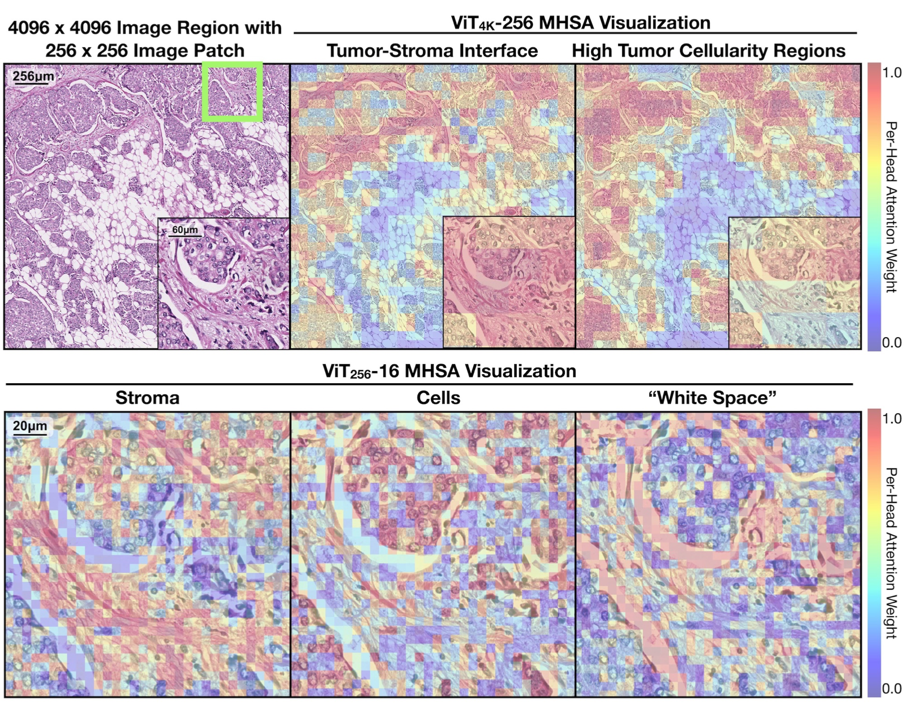

Scaling Vision Transformers to Gigapixel Images via Hierarchical Self-Supervised Learning
===========
<details>
<summary>
  <b>Scaling Vision Transformers to Gigapixel Images via Hierarchical Self-Supervised Learning</b>, CVPR 2022.
  <a href="https://openaccess.thecvf.com/content/CVPR2022/html/Chen_Scaling_Vision_Transformers_to_Gigapixel_Images_via_Hierarchical_Self-Supervised_Learning_CVPR_2022_paper.html" target="blank">[HTML]</a>
  <a href="https://arxiv.org/abs/2206.02647" target="blank">[arXiv]</a>
  <a href="https://www.youtube.com/watch?v=cABkB1J-GTA" target="blank">[Oral]</a>
	<br><em><a href="http://richarizardd.me">Richard. J. Chen</a>, <a href="https://www.kuanchchen.com">Chengkuan Chen</a>, <a href="https://www.linkedin.com/in/yicong-jackson-li/">Yicong Li</a>, <a href="https://twitter.com/tiffanyytchen">Tiffany Y. Chen</a>, <a href="https://www.gatesfoundation.org/about/leadership/andrew-trister">Andrew D. Trister</a>, <a href="http://www.cs.toronto.edu/~rahulgk/index.html">Rahul G. Krishnan*</a>, <a href="https://faisal.ai/">Faisal Mahmood*</a></em></br>
</summary>

```bash
@inproceedings{chen2022scaling,
    author    = {Chen, Richard J. and Chen, Chengkuan and Li, Yicong and Chen, Tiffany Y. and Trister, Andrew D. and Krishnan, Rahul G. and Mahmood, Faisal},
    title     = {Scaling Vision Transformers to Gigapixel Images via Hierarchical Self-Supervised Learning},
    booktitle = {Proceedings of the IEEE/CVF Conference on Computer Vision and Pattern Recognition (CVPR)},
    month     = {June},
    year      = {2022},
    pages     = {16144-16155}
}
```
</details>

<div align="center">
  
</div>

<details>
  <summary>
	  <b>Key Ideas & Main Findings</b>
  </summary>

1. **Hierarchical Image Pyramid Transformer (HIPT) Architecture:** Three-stage hierarchical ViT that formulates gigapixel whole-slide images (WSIs) as a disjoint set of nested sequences. HIPT unroll the WSI into non-overlapping ```[4096 × 4096]``` image regions, followed by unrolling each region into non-overlapping ```[256 × 256]``` image patches, and lastly each patch as non-overlapping ```[16 × 16]``` cell tokens. Our method is analgous to that of hierarchical attention networks in long document modeling, in which word embeddings within sentences are aggregated to form sentence-level embeddings and subsequently aggregated into document-level embeddings. Inference in HIPT is performed via bottom-up aggregation of ```[16 × 16]``` visual tokens in their respective ```[256 × 256]``` and ```[4096 × 4096]``` windows via Transformer attention to compute a slide-level representation.
2. **Learning Context-Aware Token Dependencies in WSIs:** Note that Transformer attention is computed only in local windows (instead of across the entire WSI), which makes learning long-range dependencies tractable. Though representation learning for ```[4096 × 4096]``` image regions may seem expensive, also note that the patch size at this level is ```[256 × 256]```, and thus has similar complexity of applying ViTs to ```[256 × 256]``` image patches with ```[16 × 16]``` tokens.
3. **Hierarchical Pretraining:** Since encoding ```[4096 x 4096]``` images is the same subproblem as encoding ```[256 x 256]``` images, we hypothesize that ViT pretraining techniques can generalize to higher resolutions with little modification. DINO is used to not only pretrain ViT-16 in HIPT, but also ViT-256 via [6 x 6] local and [14 x 14] global crops on a 2D grid-of-features (obtained by using VIT-16 as a patch tokenizer for ViT-256).
4. **Self-Supervised Slide-Level Representation Learning:** HIPT is evaluated via pretraining + freezing the ViT-16 / ViT-256 stages, with the ViT-4K stage finetuned with slide-level labels, assessed on cancer subtyping and survival prediction tasks in TCGA. We also perform self-supervised KNN evaluation of HIPT embeddings via computing the mean [CLS]-4K tokens extracted from ViT-256, as a proxy for the slide-level embedding. On Renal Cell Carcinoma subtyping, we report that averaged, pretrained HIPT-4K embeddings without any labels perform as well as CLAM-SB.
</details>

## Updates / TODOs
Please follow this GitHub for more updates.
- [ ] Removing dead code in HIPT_4K library.
- [X] Better documentation on interpretability code example.
- [x] Add pretrained models + instructions for hierarchical visualization.
- [X] Add pre-extracted slide-level embeddings, and code for K-NN evaluation.
- [X] Add weakly-supervised results for Tensorboard.

## Pre-Reqs + Installation
This repository includes not only the code base for HIPT, but also saved HIPT checkpoints and pre-extracted HIPT slide embeddings with ~4.08 GiB of storage, which we version control via [Git LFS](https://git-lfs.github.com/).

To clone this repository without large files initially:
```bash
GIT_LFS_SKIP_SMUDGE=1 git clone https://github.com/mahmoodlab/HIPT.git 	# Pulls just the codebase
git lfs pull --include "*.pth"						# Pulls the pretrained checkpoints
git lfs pull --include "*.pt"						# Pulls pre-extracted slide embeddings
git lfs pull --include "*.pkl"						# Pulls pre-extracted patch embeddings
git lfs pull --include "*.png"						# Pulls demo images (required for 4K x 4K visualization)
```
To clone all files:
```bash
git clone https://github.com/mahmoodlab/HIPT.git
```

To install Python dependencies:
```bash
pip install -r requirements.txt
```

## HIPT Walkthrough

### How HIPT Works
Below is a snippet of a standalone two-stage HIPT model architecture that can load fully self-supervised weights for nested [16 x 16] and [256 x 256] token aggregation, defined in [./HIPT_4K/hipt_4k.py](https://github.com/mahmoodlab/HIPT/blob/master/HIPT_4K/hipt_4k.py). Via a few ```einsum``` operations, you can put together multiple ViT encoders and have it scale to large resolutions. HIPT_4K was used for feature extraction of non-overlapping [4096 x 4096] image regions across the TCGA.

```python
import torch
from einops import rearrange, repeat
from HIPT_4K.hipt_model_utils import get_vit256, get_vit4k

class HIPT_4K(torch.nn.Module):
    """
    HIPT Model (ViT_4K-256) for encoding non-square images (with [256 x 256] patch tokens), with 
    [256 x 256] patch tokens encoded via ViT_256-16 using [16 x 16] patch tokens.
    """
    def __init__(self, 
        model256_path: str = 'path/to/Checkpoints/vit256_small_dino.pth',
        model4k_path: str = 'path/to/Checkpoints/vit4k_xs_dino.pth', 
        device256=torch.device('cuda:0'), 
        device4k=torch.device('cuda:1')):

        super().__init__()
        self.model256 = get_vit256(pretrained_weights=model256_path).to(device256)
        self.model4k = get_vit4k(pretrained_weights=model4k_path).to(device4k)
        self.device256 = device256
        self.device4k = device4k
        self.patch_filter_params = patch_filter_params
	
    def forward(self, x):
        """
        Forward pass of HIPT (given an image tensor x), outputting the [CLS] token from ViT_4K.
        1. x is center-cropped such that the W / H is divisible by the patch token size in ViT_4K (e.g. - 256 x 256).
        2. x then gets unfolded into a "batch" of [256 x 256] images.
        3. A pretrained ViT_256-16 model extracts the CLS token from each [256 x 256] image in the batch.
        4. These batch-of-features are then reshaped into a 2D feature grid (of width "w_256" and height "h_256".)
        5. This feature grid is then used as the input to ViT_4K-256, outputting [CLS]_4K.

        Args:
          - x (torch.Tensor): [1 x C x W' x H'] image tensor.

        Return:
          - features_cls4k (torch.Tensor): [1 x 192] cls token (d_4k = 192 by default).
        """
        batch_256, w_256, h_256 = self.prepare_img_tensor(x)                    # 1. [1 x 3 x W x H].
        batch_256 = batch_256.unfold(2, 256, 256).unfold(3, 256, 256)           # 2. [1 x 3 x w_256 x h_256 x 256 x 256] 
        batch_256 = rearrange(batch_256, 'b c p1 p2 w h -> (b p1 p2) c w h')    # 2. [B x 3 x 256 x 256], where B = (1*w_256*h_256)


        features_cls256 = []
        for mini_bs in range(0, batch_256.shape[0], 256):                       # 3. B may be too large for ViT_256. We further take minibatches of 256.
            minibatch_256 = batch_256[mini_bs:mini_bs+256].to(self.device256, non_blocking=True)
            features_cls256.append(self.model256(minibatch_256).detach().cpu()) # 3. Extracting ViT_256 features from [256 x 3 x 256 x 256] image batches.

        features_cls256 = torch.vstack(features_cls256)                         # 3. [B x 384], where 384 == dim of ViT-256 [ClS] token.
        features_cls256 = features_cls256.reshape(w_256, h_256, 384).transpose(0,1).transpose(0,2).unsqueeze(dim=0) 
        features_cls256 = features_cls256.to(self.device4k, non_blocking=True)  # 4. [1 x 384 x w_256 x h_256]
        features_cls4k = self.model4k.forward(features_cls256)                  # 5. [1 x 192], where 192 == dim of ViT_4K [ClS] token.
        return features_cls4k
```

### Using the HIPT_4K API
You can use the HIPT_4K model out-of-the-box, and use it to plug-and-play into any of your downstream tasks (example below).
```python
from HIPT_4K.hipt_4k import HIPT_4K
from HIPT_4K.hipt_model_utils import eval_transforms

model = HIPT_4K()
model.eval()

region = Image.open('HIPT_4K/image_demo/image_4k.png')
x = eval_transforms()(region).unsqueeze(dim=0)
out = model.forward(x)
```

### Hierarchical Interpretability

<div align="center">
  
</div>

For hierarchical interpretability, please see the [following notebook](https://github.com/mahmoodlab/HIPT/blob/master/HIPT_4K/HIPT_4K%20Inference%20%2B%20Attention%20Visualization.ipynb), which uses the following functions in [./HIPT_4K/hipt_heatmap_utils.py](https://github.com/mahmoodlab/HIPT/blob/master/HIPT_4K/hipt_heatmap_utils.py).


## Downloading + Preprocessing + Organizing TCGA Data
Using the [NIH Genomic Data Commons Data Portal](https://portal.gdc.cancer.gov/) and the [cBioPortal](https://www.cbioportal.org/), we downloaded diagnostic whole-slide images (WSIs) for 28 cancer types using the [GDC Data Transfer Tool](https://docs.gdc.cancer.gov/Data_Transfer_Tool/Users_Guide/Data_Download_and_Upload/), followed by using the publicly-available [CLAM library](https://github.com/mahmoodlab/CLAM) for tissue segmentation, tissue patching and feature extraction, which we modified for extracting both ResNet-50 features (pretrained on ImageNet) and ViT-16 features (pretrained on the TCGA). For patching at `[256 × 256]` resolution, we used default tissue segmentation parameters. For patching at `[4096 × 4096]` resolution, we additionally saved each `[4096 × 4096]` image region, which we used for ViT_256-16 and ViT_4096-256 pretraining (`-16` suffix == using [16 × 16]-sized tokens in a ViT model, `-256` suffix == using [256 × 256]-sized tokens in a ViT model). Extracted TCGA features are organized in the following directories:
<details>
<summary>
Example Directory
</summary>
  
```bash
TCGA_ROOT_DIR/
    └──tcga_acc/
        ├── ...
    └──tcga_blca/
        ├── ...
    └──tcga_brca/
        └── WSIs/
            ├── slide_1.svs
            ├── slide_2.svs
            └── ...
        └── extracted_mag20x_patch256_fp/
            └── masks/
                ├── slide_1.png
                ├── slide_2.png
                └── ...
            └── patches/
                ├── slide_1.h5
                ├── slide_2.h5
                └── ...
            └── stitches/
                ├── slide_1.png
                ├── slide_2.png
                └── ...
            └── resnet50_trunc_pt_patch_features/
                ├── slide_1.pt
                ├── slide_2.pt
                └── ...
            └── vits_tcga_pancancer_dino_pt_patch_features/
                ├── slide_1.pt
                ├── slide_2.pt
                └── ...
            └── process_list_autogen.csv
        └── extracted_mag20x_patch4096_fp/
            └── masks/
                ├── slide_1.png
                ├── slide_2.png
                └── ...
            └── patches/
                ├── slide_1.h5
                ├── slide_2.h5
                └── ...
            └── stitches/
                ├── slide_1.png
                ├── slide_2.png
                └── ...
            └── tar_patch_4096/
                ├── slide_1.tar
                ├── slide_2.tar
                └── ...
            └── vits_tcga_pancancer_dino_pt_patch_features/
                ├── slide_1.pt
                ├── slide_2.pt
                └── ...
            └── process_list_autogen.csv
    └──tcga_coadread/
        ├── ...
    ...
    └──tcga_ucec/
        ├── ...
```
</details>

Each cancer type is organized as its own folder in `TCGA_ROOT_DIR`, which additionally contains the following subfolders:
In extracting patches at 20X magnification with non-overlapping patch sizes of 256, we create a results directory called `extracted_mag20x_patch256_fp` that will contain the following files / folders:
<details>
  <summary>
    Folder Structure
  </summary>
  
1. `WSIs/`: Raw `*.svs` WSIs for that cancer type
2. `extracted_mag20x_patch256_fp`: Extracted features at 20× magnification for `[256 × 256]` patches (performed only for BRCA, COADREAD, LUAD, LUSC, CCRCC, CHRCC, PRCC, and STAD studies in TCGA). The `_fp` suffix represents the use of 'fast patching" as performed in CLAM, in which coordinates instead of raw patches are saved. This folder contains the following subfolders:
    - `masks/`: Directory of segmented tissue-containing regions (one image per WSI).
    - `patches/`: Directory of extracted image patches (one .h5 file per WSI, where each entry corresponds to the coordinates of the top-left corner of a patch)
    - `stitches/`: Directory of downsampled visualizations of stitched tissue patches, used a sanity check to inspect whether we patched correctly (one image per WSI). 
    - `resnet50_trunc_pt_patch_features/`: Directory of pre-extracted ResNet-50 features (pretrained on ImageNet) for each patch within each WSI (with patches read via OpenSlide using coordinates in `patches/`, saved in a `*.pt` format. Each `*.pt` file is a `[M × 1024]`-sized Tensor containing extracted 1024-dim embeddings for `M` patches in the WSI.
    - `vits_tcga_pancancer_dino_pt_patch_features/`: Directory of pre-extracted ViT-16 features (pretrained on TCGA) for each patch within each WSI (with patches read via OpenSlide using coordinates in `patches/`, saved in a `*.pt` format. Each `*.pt` file is a `[M × 384]`-sized Tensor containing extracted 384-dim embeddings for `M` patches in the WSI.
    - `process_list_autogen.csv`: An auto-generated csv file that contains a list of all slides processed, along with their segmentation/patching parameters used.
3. `extracted_mag20x_patch4096_fp`: Extracted features at 20× magnification for `[4096 × 4096]` image regions, containing the following subfolders:
    - `masks/`: Same as `[256 × 256]` setting.
    - `patches/`: Same as `[256 × 256]` setting.
    - `stitches/`: Same as `[256 × 256]` setting.
    - `tar_patch_4096/`: Directory of saved `[4096 × 4096]` image regions for each WSI, stored in a `*.tar` format using [WebDataset](https://github.com/webdataset/webdataset) API.
    - `vits_tcga_pancancer_dino_pt_patch_features/`: Directory of pre-extracted ViT-16 features (pretrained on TCGA) for each `[4096 × 4096]` region within each WSI (with regions read via OpenSlide using coordinates in `patches/`, saved in a `*.pt` format. Each `*.pt` file is a `[M × 256 × 384]`-sized Tensor containing extracted 384-dim embeddings for `M` regions in the WSI, which each region represented as as a 256-length sequence of `[256 × 256]` patch embeddings.
    - `process_list_autogen.csv`: An auto-generated csv file that contains a list of all slides processed, along with their segmentation/patching parameters used. Note that in using a large image resolution for patching, not all WSIs are used in `[4096 × 4096]` evaluation.
</details>

Organizing the folders and subfolders for all of these different cancer types (with different features types too) allowed ease of running classification experiments.
 
## Hierarchical Pretraining for ViT-16/256 Models + Pretrained Models
<details>
<summary>
Example Directory
</summary>
  
```bash
TCGA_PRETRAINING_DIR/
  └──patch_256_pretraining/
      ├── patch_1.png
      ├── patch_2.png
      └── ...
  └──region_4096_pretraining/
      ├── slide_1_1.pt
      ├── slide_1_2.pt
      └── ...
  └──ckpts/
      └── pretrain/
          └── vit256_s_dino.pth
          └── vit4k_xs_dino.pth
 ```
 </details>
 
 We set up the following directories for ViT_256-16 and ViT_4K-256 pretraining respectively:
  - `.../path/to/patch_256_pretraining/`: Directory of raw `[256 × 256]` patches (as `*.png` format) extracted from the `tar_patch_4096/` subdirectories of each cancer type, used to pretrain ViT_256-16.
  - `.../path/to/region_4096_pretraining/`: Directory of pre-extracted ViT_4K-256 features for each `[4096 × 4096]` region across all WSIs (in total: 433779 regions). Each `*.pt` file is a `[256 × 384]`-sized Tensor, which is a 256-length sequence of pre-extracted ViT_256-16 features for each `[256 × 256]` patch. This folder is used to pretain ViT_4K-256.
  - `./HIPT_4K/Checkpoints/`: Directory for holding the pretrained weights, which we use for feature extraction. Our pretraining method largely follows the original [DINO](https://github.com/facebookresearch) framework for conventional `[256 × 256]` image pretraining using ViT_256-16, which we extend to the `[4096 × 4096]` setting. Again, note that the `-16` suffix refers to using [16 × 16]-sized tokens in a ViT model, and the `-256` suffix using [256 × 256]-sized tokens in a ViT model. The following commands below are used for pretraining.

```python
python -m torch.distributed.launch --nproc_per_node=8 main_dino.py --arch vit_small --data_path /path/to/TCGA_PRETRAINING_DIR/patch_256_pretraining/ --output_dir /path/to/TCGA_PRETRAINING_DIR/ckpts/pretrain/ --epochs 100
python -m torch.distributed.launch --nproc_per_node=8 main_dino4k.py --arch vit_xs --data_path /path/to/TCGA_PRETRAINING_DIR/region_4k_pretraining/ --output_dir /path/to/TCGA_PRETRAINING_DIR/ckpts/pretrain/ --epochs 100
```


<table>
  <tr>
    <th>SSL Strategy</th>
    <th>ViT SSL</th>
    <th>Dataset</th>
    <th>Iteration</th>
    <th>Batch Size</th>
    <th>Arch</th>
    <th>Image Size</th>
    <th>Token Size</th>
    <th>Dim</th>
    <th>Download</th>
  </tr>
  
  <tr>
    <td rowspan="2">Hierarchical Pretraining</td>
    <td><a href="https://github.com/facebookresearch/dino">DINO</a></td>
    <td>TCGA</td>
    <td>400,000</td>
    <td>256</td>
    <td>ViT-S/16</td>
    <td>256</td>
    <td>16</td>
    <td>384</td>
    <td><a href="https://github.com/mahmoodlab/HIPT/blob/master/HIPT_4K/Checkpoints/vit256_small_dino.pth">Backbone</a></td>
  </tr>
	
  <tr>
    <td><a href="https://github.com/facebookresearch/dino">DINO</a></td>
    <td>TCGA</td>
    <td>200,000</td>
    <td>256</td>
    <td>ViT-XS/256</td>
    <td>4096</td>
    <td>256</td>
    <td>192</td>
    <td><a href="https://github.com/mahmoodlab/HIPT/blob/master/HIPT_4K/Checkpoints/vit4k_xs_dino.pth">Backbone</a></td>
  </tr>
</table>


## Weakly-Supervised Training + Evaluation
Following ViT-16/256 pretraining and pre-extracting instance-level `[256 × 256]` features using ViT-16, we extend the publicly-available CLAM scaffold code for running 10-fold cross-validation experiments as well as implement several of the current weakly-supervised baselines. Our main method is `hipt_lgp` (abbreviated for HIPT with Local-Global Pretraining). We make available our [saved results directory](https://github.com/mahmoodlab/HIPT/tree/master/2-Weakly-Supervised-Subtyping/results_cvpr2022_class), [evaluation code](https://github.com/mahmoodlab/HIPT/blob/master/2-Weakly-Supervised-Subtyping/Evaluation-Classification.ipynb), and a [Jupyter Notebook](https://github.com/mahmoodlab/HIPT/blob/master/2-Weakly-Supervised-Subtyping/Model%20Walkthrough.ipynb) containing a walkthrough of our method.

<details>
<summary>
Full List of Training Classification Commands
</summary>

```python
GPU=0
DATAROOT=/path/to/TCGA_ROOT_DIR/
TASK=tcga_brca_subtype
CUDA_VISIBLE_DEVICES=$GPU python main.py --data_root_dir $DATAROOT --model_type hipt_lgp --task $TASK --prop 0.25
CUDA_VISIBLE_DEVICES=$GPU python main.py --data_root_dir $DATAROOT --model_type hipt_lgp --task $TASK --prop 1.0
CUDA_VISIBLE_DEVICES=$GPU python main.py --data_root_dir $DATAROOT --model_type hipt_lgp --task $TASK --prop 0.25 --pretrain_4k vit4k_xs_dino
CUDA_VISIBLE_DEVICES=$GPU python main.py --data_root_dir $DATAROOT --model_type hipt_lgp --task $TASK --prop 1.0 --pretrain_4k vit4k_xs_dino
CUDA_VISIBLE_DEVICES=$GPU python main.py --data_root_dir $DATAROOT --model_type hipt_lgp --task $TASK --prop 0.25 --pretrain_4k vit4k_xs_dino --freeze_4k
CUDA_VISIBLE_DEVICES=$GPU python main.py --data_root_dir $DATAROOT --model_type hipt_lgp --task $TASK --prop 1.0 --pretrain_4k vit4k_xs_dino --freeze_4k
TASK=tcga_kidney_subtype
CUDA_VISIBLE_DEVICES=$GPU python main.py --data_root_dir $DATAROOT --model_type hipt_lgp --task $TASK --prop 0.25
CUDA_VISIBLE_DEVICES=$GPU python main.py --data_root_dir $DATAROOT --model_type hipt_lgp --task $TASK --prop 1.0
CUDA_VISIBLE_DEVICES=$GPU python main.py --data_root_dir $DATAROOT --model_type hipt_lgp --task $TASK --prop 0.25 --pretrain_4k vit4k_xs_dino
CUDA_VISIBLE_DEVICES=$GPU python main.py --data_root_dir $DATAROOT --model_type hipt_lgp --task $TASK --prop 1.0 --pretrain_4k vit4k_xs_dino
CUDA_VISIBLE_DEVICES=$GPU python main.py --data_root_dir $DATAROOT --model_type hipt_lgp --task $TASK --prop 0.25 --pretrain_4k vit4k_xs_dino --freeze_4k
CUDA_VISIBLE_DEVICES=$GPU python main.py --data_root_dir $DATAROOT --model_type hipt_lgp --task $TASK --prop 1.0 --pretrain_4k vit4k_xs_dino --freeze_4k
TASK=tcga_lung_subtype
CUDA_VISIBLE_DEVICES=$GPU python main.py --data_root_dir $DATAROOT --model_type hipt_lgp --task $TASK --prop 0.25
CUDA_VISIBLE_DEVICES=$GPU python main.py --data_root_dir $DATAROOT --model_type hipt_lgp --task $TASK --prop 1.0
CUDA_VISIBLE_DEVICES=$GPU python main.py --data_root_dir $DATAROOT --model_type hipt_lgp --task $TASK --prop 0.25 --pretrain_4k vit4k_xs_dino
CUDA_VISIBLE_DEVICES=$GPU python main.py --data_root_dir $DATAROOT --model_type hipt_lgp --task $TASK --prop 1.0 --pretrain_4k vit4k_xs_dino
CUDA_VISIBLE_DEVICES=$GPU python main.py --data_root_dir $DATAROOT --model_type hipt_lgp --task $TASK --prop 0.25 --pretrain_4k vit4k_xs_dino --freeze_4k
CUDA_VISIBLE_DEVICES=$GPU python main.py --data_root_dir $DATAROOT --model_type hipt_lgp --task $TASK --prop 1.0 --pretrain_4k vit4k_xs_dino --freeze_4k
```
</details>
 
Analagously, we also use the [MCAT](https://github.com/mahmoodlab/MCAT) scaffold code for survival prediction, and make available our [saved results directory / tensorboard logs](https://github.com/mahmoodlab/HIPT/tree/master/2-Weakly-Supervised-Survival/results_2022_surv/5foldcv) and [evaluation code](https://github.com/mahmoodlab/HIPT/blob/master/2-Weakly-Supervised-Survival/Evaluation-Survival.ipynb).
<details>
<summary>
Full List of Training Survival Commands
</summary>
 
```python
DATAROOT=/path/to/TCGA_ROOT_DIR/
GPU=0
CUDA_VISIBLE_DEVICES=$GPU python main.py --data_root_dir $DATAROOT --which_splits 5foldcv --split_dir tcga_brca --mode pyramid --model_type hipt_lgp --pretrain_4k vit4k_xs_dino --freeze_4k
CUDA_VISIBLE_DEVICES=$GPU python main.py --data_root_dir $DATAROOT --which_splits 5foldcv --split_dir tcga_coadread --mode pyramid --model_type hipt_lgp --pretrain_4k vit4k_xs_dino --freeze_4k
CUDA_VISIBLE_DEVICES=$GPU python main.py --data_root_dir $DATAROOT --which_splits 5foldcv --split_dir tcga_kirc --mode pyramid --model_type hipt_lgp --pretrain_4k vit4k_xs_dino --freeze_4k
CUDA_VISIBLE_DEVICES=$GPU python main.py --data_root_dir $DATAROOT --which_splits 5foldcv --split_dir tcga_kirp --mode pyramid --model_type hipt_lgp --pretrain_4k vit4k_xs_dino --freeze_4k
CUDA_VISIBLE_DEVICES=$GPU python main.py --data_root_dir $DATAROOT --which_splits 5foldcv --split_dir tcga_luad --mode pyramid --model_type hipt_lgp --pretrain_4k vit4k_xs_dino --freeze_4k
CUDA_VISIBLE_DEVICES=$GPU python main.py --data_root_dir $DATAROOT --which_splits 5foldcv --split_dir tcga_stad --mode pyramid --model_type hipt_n --pretrain_4k vit4k_xs_dino --freeze_4k
```
</details>

## Understanding Baselines, Clarifications, and Future Work
In making the pretrained weights for HIPT fully-available, we hope that HIPT can be plugged-and-played in your experiments, and you would find the same level of improvement :). In building off of this work, we clarify a few details:
- As slide-level tasks in the TCGA do not have official benchmarks, reported AUC performance may vary with different train-test splits. The results in this work use the following 10-fold CV and 5-fold CV train-test splits, which have been used consistently in prior works. Though the comparisons of MIL architecture performance are equivalent (all methods using same pretrained patch-level embeddings), general comparisons with MIL performance of prior works cannot be made, as: 1) different patch-level embeddings are used for training MIL methods (ImageNet ResNet-50 vs. SSL ViT-16), 2) a number of WSIs were excluded in each cohort, due to the lack of tissue content in patching at [4096 x 4096] resolution. To reproduce the results of this paper, you must use the exact train-test splits with the same pretrained embedding type.
- Despite average ViT_4K-256 performing well in KNN evaluation, average ViT_256-16 embeddings did not perform as well as mean ResNet-50 (transferred from ImageNet) embeddings on some of the downstream tasks. Since Hierarchical Pretraining of ViT_4K-256 depends on pre-extracted ViT_256-16 embeddings, there is (of course) considerable room for improvement in boosting unsupervised and weakly-supervised slide-level performance in refining the ViT_256-16 encoder.


## Issues
- Please open new threads or report issues directly to richardchen@g.harvard.edu.

## Acknowledgements, License & Usage 
- We thank Felix Yu, Ming Y. Lu, Chunyuan Li, and the BioML group at Microsoft Research New England for their insightful feedback.
- Code for Weakly-Supervised Subtyping + Survival Classification was largely adapted from [CLAM](https://github.com/mahmoodlab/CLAM) and [MCAT](https://github.com/mahmoodlab/MCAT)
- Code for Hierarchical Pretraining was largely adapted via making modifications to [DINO](https://github.com/facebookresearch/dino)
- Code for self-supervised evaluation was built on our previous [NeurIPS workshop paper](https://github.com/Richarizardd/Self-Supervised-ViT-Path)
- If you found our work useful in your research, please consider citing our works(s) at:

```bash
@article{chen2022self,
    author    = {Chen, Richard J and Krishnan, Rahul G},
    title     = {Self-Supervised Vision Transformers Learn Visual Concepts in Histopathology},
    journal   = {Learning Meaningful Representations of Life, NeurIPS 2021},
    year      = {2021},
}

@inproceedings{chen2022scaling,
    author    = {Chen, Richard J. and Chen, Chengkuan and Li, Yicong and Chen, Tiffany Y. and Trister, Andrew D. and Krishnan, Rahul G. and Mahmood, Faisal},
    title     = {Scaling Vision Transformers to Gigapixel Images via Hierarchical Self-Supervised Learning},
    booktitle = {Proceedings of the IEEE/CVF Conference on Computer Vision and Pattern Recognition (CVPR)},
    month     = {June},
    year      = {2022},
    pages     = {16144-16155}
}
```
Any work that cites HIPT should also cite the [original Vision Transformer](https://arxiv.org/abs/2010.11929) and [DINO](https://github.com/facebookresearch/dino).


© This code is made available under the Commons Clasuse License and is available for non-commercial academic purposes.

